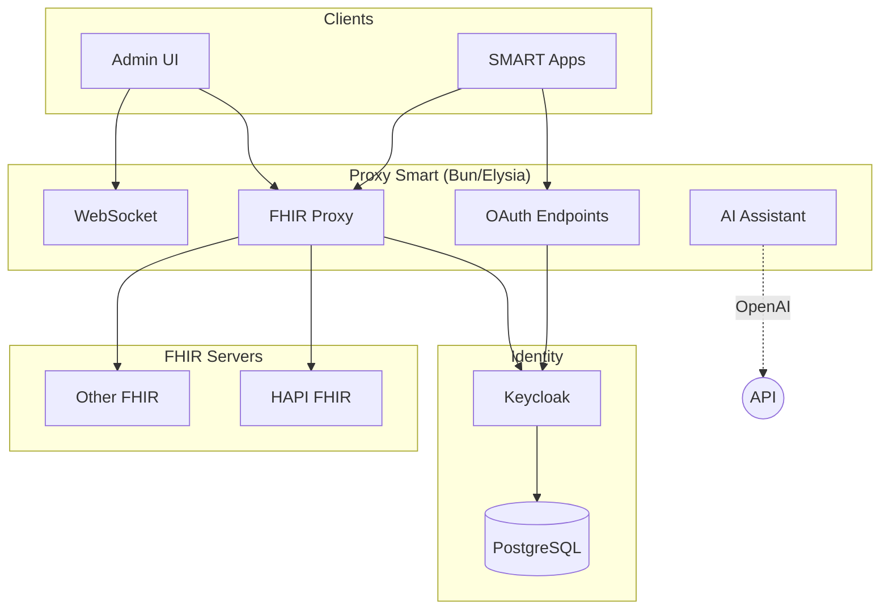

# Proxy Smart

<p align="center">
  <strong>A stateless proxy that adds OAuth 2.0 and SMART App Launch authorization to existing FHIR servers.</strong>
</p>

<!-- Version & Spec Badges -->
<p align="center">
  <a href="https://github.com/max-health-inc/proxy-smart/releases"></a>
  <a href="http://hl7.org/fhir/smart-app-launch/"></a>
  <a href="https://hl7.org/fhir/R4/"></a>
</p>

<!-- Tech Stack Badges -->
<p align="center">
  
  
  
  
  
  <a href="LICENSE-DUAL.md"></a>
</p>

<p align="center">
  <a href="#quick-start">Quick Start</a> •
  <a href="#features">Features</a> •
  <a href="#architecture">Architecture</a> •
  <a href="#documentation">Documentation</a> •
  <a href="https://discord.gg/FshSApM7">Discord</a>
</p>

---

## What is Proxy Smart?

Proxy Smart sits between your SMART apps and FHIR servers, handling authentication and authorization. It doesn't store any clinical data — requests pass through to your existing FHIR servers, and the proxy manages OAuth flows and access control.

| You provide | Proxy Smart handles |
|---|---|
| A FHIR server (HAPI FHIR, Microsoft FHIR Server, AWS HealthLake, etc.) | SMART App Launch 2.2.0 flows |
| Keycloak (included in Docker setup) | OAuth 2.0 authorization & token management |
| Your SMART apps | Scope-based access control & FHIR proxying |

## Quick Start

**Requirements:** Node.js ≥18, Bun ≥1.0, Docker

```bash
# Clone the repository
git clone https://github.com/max-health-inc/proxy-smart.git
cd proxy-smart

# Start everything
bun docker:dev
bun install
bun run dev
```

Then open:

| Service | URL |
|---|---|
| Admin UI | http://localhost:3000 |
| Backend API | http://localhost:8080 |
| Keycloak | http://localhost:8090 |

See the [Getting Started Guide](docs/tutorials/getting-started.md) for initial configuration.

## Features

### 🔐 Stateless FHIR Proxy

No clinical data in the proxy means a smaller attack surface, simpler compliance (HIPAA, GDPR), easy horizontal scaling, and less infrastructure to manage. Audit logging for access patterns and OAuth flows is available when needed.

### 🏥 SMART App Launch 2.2.0

Full implementation of the [SMART App Launch](http://hl7.org/fhir/smart-app-launch/) specification — apps that follow the standard work out of the box. OAuth 2.0 with PKCE, JWT validation, scope-based access control, refresh token rotation, and enterprise SSO via SAML 2.0 and OIDC.

### 🖥️ Admin Dashboard

Built-in React admin UI for managing SMART apps, FHIR server connections, users, and scopes — no manual config editing required.

### 🤖 AI Assistant & MCP Server

Built-in AI assistant with RAG for documentation queries, exposed via an [MCP server](docs/MCP_HTTP_SERVER.md) for programmatic integration with AI tools.

### 🐳 Docker-Ready

One-command development and production deployments with Docker Compose, including mono-container and multi-container options.

## Architecture

```
SMART App → Proxy Smart → FHIR Server
                ↓
            Keycloak (OAuth)
```



### Tech Stack

| Layer | Technologies |
|---|---|
| **Backend** | Bun, Elysia, TypeScript |
| **Frontend** | React 19, Vite, Tailwind CSS |
| **Identity** | Keycloak + PostgreSQL |
| **Testing** | Vitest, Playwright |
| **Infra** | Docker, AWS CDK |

> PostgreSQL only stores user/config data. Clinical data stays on your FHIR servers.

## Documentation

<table>
<tr>
<td width="50%" valign="top">

### Getting Started
- [Getting Started Guide](docs/tutorials/getting-started.md)
- [API Documentation](docs/api/)
- [SMART 2.2.0 Implementation Status](docs/SMART_2.2.0_CHECKLIST.md)

### Admin UI
- [Dashboard](docs/admin-ui/dashboard.md)
- [User Management](docs/admin-ui/user-management.md)
- [SMART Apps](docs/admin-ui/smart-apps.md)
- [FHIR Servers](docs/admin-ui/fhir-servers.md)
- [Scope Management](docs/admin-ui/scope-management.md)

</td>
<td width="50%" valign="top">

### Technical
- [OAuth 2.0 Flows](docs/smart-on-fhir/oauth-flows.md)
- [Launch Contexts](docs/smart-on-fhir/launch-contexts.md)
- [Version Management](docs/VERSION_MANAGEMENT.md)

### AI & MCP
- [MCP HTTP Server](docs/MCP_HTTP_SERVER.md)
- [MCP Integration](docs/AI_MCP_INTEGRATION.md)
- [Backend API Tools](docs/BACKEND_API_TOOLS.md)

</td>
</tr>
</table>

## Docker

```bash
# Development (mono container)
bun run docker:dev
# → http://localhost:8445/webapp/

# Production (separate containers)
bun run docker:prod
# → Frontend: http://localhost:3000
# → Backend: http://localhost:8445
```

<details>
<summary>All Docker commands</summary>

| Command | Description |
|---|---|
| `bun run docker:dev` | Start dev containers |
| `bun run docker:dev:build` | Build and start |
| `bun run docker:dev:down` | Stop |
| `bun run docker:dev:logs` | View logs |
| `bun run docker:prod` | Start prod containers |
| `bun run docker:prod:build` | Build and start |
| `bun run docker:prod:down` | Stop |
| `bun run docker:prod:logs` | View logs |
| `bun run docker:backend` | Backend only |
| `bun run docker:ui` | UI only |
| `bun run docker:mono` | Monolithic |

</details>

## Roadmap

**Current**: `v0.0.2-alpha` — Working toward SMART App Launch 2.2.0 compliance.

| Milestone | Goal |
|---|---|
| **v0.0.5-beta** | PKCE, v2 scope syntax, token introspection |
| **v0.1.0** | Full SMART 2.2.0 compliance |
| **v1.0.0** | Production ready |

See the [implementation checklist](docs/SMART_2.2.0_CHECKLIST.md) for details.

## Branching Strategy

| Branch | Purpose |
|---|---|
| `main` | Production releases (auto-tagged) |
| `test` | Beta releases (`-beta` suffix) |
| `develop` | Alpha releases (`-alpha` suffix) |
| `dev/*` | Feature branches (no PR required) |

## Contributing

1. Fork the repo
2. Create a branch (`dev/your-feature`)
3. Make changes with tests
4. Submit PR

See [CONTRIBUTING.md](CONTRIBUTING.md) for guidelines.

## License

Dual licensed:

- **AGPL v3** — open source / non-commercial use
- **Commercial license** — available for proprietary use

See [LICENSE-DUAL.md](LICENSE-DUAL.md) for details.

## Support

- 🤖 AI Assistant (built-in)
- 💬 [Discord](https://discord.gg/FshSApM7)
- 📖 [Documentation](docs/)
- 🐛 [GitHub Issues](https://github.com/max-health-inc/proxy-smart/issues)

---

<p align="center">
  <a href="http://hl7.org/fhir/smart-app-launch/">SMART App Launch</a> •
  <a href="https://hl7.org/fhir/R4/">FHIR R4</a> •
  <a href="https://www.keycloak.org/">Keycloak</a>
</p>
