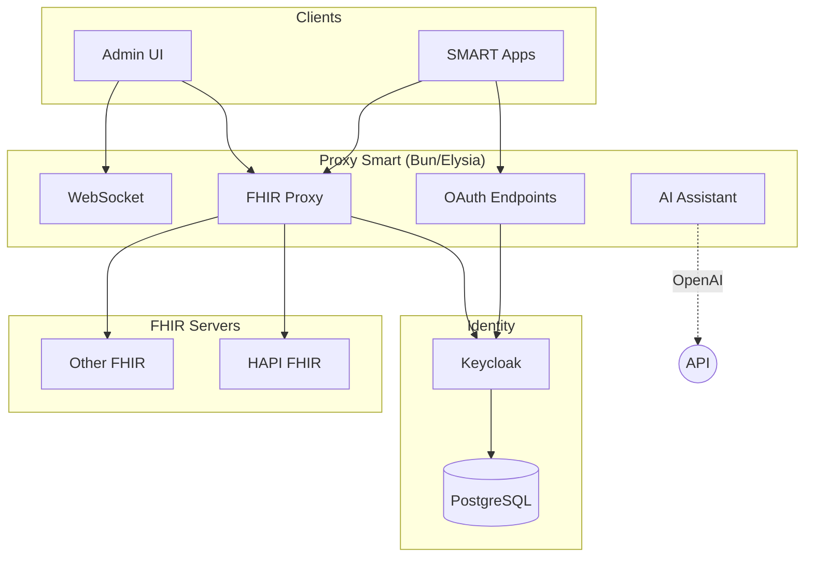

# Proxy Smart

A stateless proxy that adds OAuth 2.0 and SMART App Launch authorization to existing FHIR servers.

[](https://github.com/quotentiroler/proxy-smart)
[](http://hl7.org/fhir/smart-app-launch/)
[](https://hl7.org/fhir/R4/)

## What it does

Proxy Smart sits between your SMART apps and FHIR servers, handling authentication and authorization. It doesn't store any clinical data - requests pass through to your existing FHIR servers, and the proxy just manages OAuth flows and access control.

You'll need:
- A FHIR server (HAPI FHIR, Microsoft FHIR Server, AWS HealthLake, etc.)
- Keycloak (included in the Docker setup)
- This proxy

The proxy implements SMART App Launch 2.2.0, so apps that follow the spec should work out of the box.

## Architecture

```
SMART App → Proxy Smart → FHIR Server
                ↓
            Keycloak (OAuth)
```



### Tech Stack

- **Backend**: Bun, Elysia, TypeScript
- **Frontend**: React, Vite, Tailwind CSS
- **Identity**: Keycloak + PostgreSQL
- **Testing**: Jest, Playwright

PostgreSQL only stores user/config data. Clinical data stays on your FHIR servers.

## Why stateless?

No clinical data in the proxy means:
- Smaller attack surface
- Simpler compliance (HIPAA, GDPR)
- Easy horizontal scaling
- Less infrastructure to manage

You can still enable audit logging for access patterns and OAuth flows if needed.

## Getting Started

Requirements: Node.js ≥18, Bun ≥1.0, Docker

```bash
git clone https://github.com/quotentiroler/proxy-smart.git
cd proxy-smart

# Start everything
bun docker:dev
bun install
bun run dev
```

Then open:
- Admin UI: http://localhost:3000
- Backend API: http://localhost:8080
- Keycloak: http://localhost:8090

See the [Getting Started Guide](docs/tutorials/getting-started.md) for initial configuration.

## Documentation

- [Getting Started](docs/tutorials/getting-started.md)
- [API Documentation](docs/api/)
- [SMART 2.2.0 Implementation Status](docs/SMART_2.2.0_CHECKLIST.md)

### Admin UI
- [Dashboard](docs/admin-ui/dashboard.md)
- [User Management](docs/admin-ui/user-management.md)
- [SMART Apps](docs/admin-ui/smart-apps.md)
- [FHIR Servers](docs/admin-ui/fhir-servers.md)
- [Scope Management](docs/admin-ui/scope-management.md)

### Technical
- [OAuth 2.0 Flows](docs/smart-on-fhir/oauth-flows.md)
- [Launch Contexts](docs/smart-on-fhir/launch-contexts.md)
- [Version Management](docs/VERSION_MANAGEMENT.md)

## AI Assistant

There's a built-in AI assistant with RAG for documentation queries, exposed via MCP server.

## Docker

```bash
# Development (mono container)
bun run docker:dev
# → http://localhost:8445/webapp/

# Production (separate containers)
bun run docker:prod
# → Frontend: http://localhost:3000
# → Backend: http://localhost:8445
```

See the full list of Docker commands below.

<details>
<summary>All Docker commands</summary>

```bash
# Development
bun run docker:dev              # Start dev containers
bun run docker:dev:build        # Build and start
bun run docker:dev:down         # Stop
bun run docker:dev:logs         # Logs

# Production
bun run docker:prod             # Start prod containers
bun run docker:prod:build       # Build and start
bun run docker:prod:down        # Stop
bun run docker:prod:logs        # Logs

# Individual builds
bun run docker:backend          # Backend only
bun run docker:ui               # UI only
bun run docker:mono             # Monolithic
```

</details>

## Branching

- `main` → production releases (auto-tagged)
- `test` → beta releases (`-beta` suffix)
- `develop` → alpha releases (`-alpha` suffix)
- `dev/*` → feature branches (no PR required)

## Status

**Current**: v0.0.2-alpha

Working toward SMART App Launch 2.2.0 compliance. See the [implementation checklist](docs/SMART_2.2.0_CHECKLIST.md) for details.

**Next milestones:**
- v0.0.5-beta: PKCE, v2 scope syntax, token introspection
- v0.1.0: Full SMART 2.2.0 compliance
- v1.0.0: Production ready

## Security

OAuth 2.0 with PKCE, JWT validation, scope-based access control, refresh token rotation. Supports SAML 2.0 and OIDC for enterprise SSO.

## Contributing

1. Fork the repo
2. Create a branch (`dev/your-feature`)
3. Make changes with tests
4. Submit PR

See [CONTRIBUTING.md](CONTRIBUTING.md) for guidelines.

## License

Dual licensed:

- **AGPL v3** for open source / non-commercial use
- **Commercial license** available for proprietary use

See [LICENSE-DUAL.md](LICENSE-DUAL.md) for details.

## Support

- AI Assistant (built-in)
- [Discord](https://discord.gg/FshSApM7)
- [Documentation](docs/)
- [GitHub Issues](https://github.com/quotentiroler/proxy-smart/issues)

## Links

- [SMART App Launch Framework](http://hl7.org/fhir/smart-app-launch/)
- [FHIR R4](https://hl7.org/fhir/R4/)
- [Keycloak](https://www.keycloak.org/)
